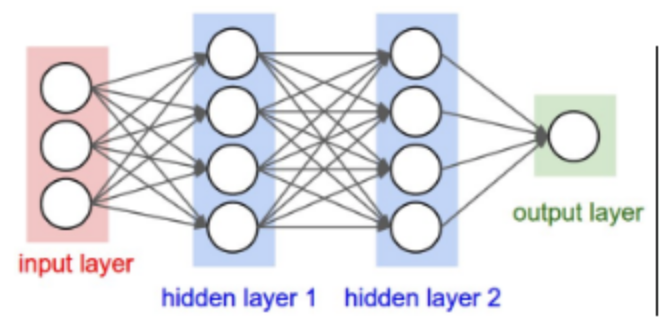

# 简介
本文为快速学习入门Pytorch。
学习之道：明白目的；pytorchd的结构框架；pytorch的使用。

- 目的：An open source deep learning platform that provides a seamless path from research prototyping to production deployment.
- 结构：平台，对象，操作，框架
- 使用：引用，使用

# 10分钟快速入门PyTorch (0)

##  环境配置
根据URL： https://pytorch.org/get-started/locally/
安装： `pip3 install torch torchvision`
## pytorch基础
介绍一下pytorch处理的对象以及操作。
## Tensor
首先介绍里面最基本的操作对象，tensor。
使用`jupytert notebook`:


tensor就是张量的英文，表示**多维的矩阵**，比如一维就是向量，二维就是一般的矩阵等等，**pytorch里面处理的单位就是一个一个的tensor**.可以显示的得到其大小


这个和numpy很相似，同时tensor和numpy.array之间也可以相互转换.

tensor的运算也很简单，一般的四则运算都是支持的

## Variable
pytorch和numpy不一样的地方就来了，就是其提供了**自动求导功能**，也就是可以**自动给你你要的参数的梯度**，这个操作由另外一个基本元素提供，Variable

本质上Variable和Tensor没有区别，不过**Variable会放入一个计算图，然后进行前向传播，反向传播以及自动求导**.
一个Variable里面包含着三个属性，data，grad和creator，其中**creator表示得到这个Variabel的操作**，比如乘法或者加法等等，**grad表示方向传播的梯度**，**data表示取出这个Variabel里面的数据**

这就是一个简单的计算图的例子

## 神经网络
前面讲了两个操作对象，最后讲一下pytorch里面的**模型建立**，**模型的建立主要依赖于torch.nn**，torch.nn包含这个所有神经网络的层的结构。


这就是构建所有神经网络的模板，不管你想**构建卷积神经网络还是循环神经网络或者是生成对抗网络都依赖于这个结构**.
[代码网址](https://github.com/L1aoXingyu/pytorch-beginner)

# 10分钟快速入门PyTorch (1)
以上基本的介绍了pytorch里面的**操作单元，Tensor，以及计算图中的操作单位Variable**，相信大家都已经熟悉了，下面这一部分我们就从两个最基本的机器学习，**线性回归以及logistic回归**来开始建立我们的计算图进行运算。

## 线性回归
对于线性回归，相信大家都很熟悉了，各种机器学习的书第一个要讲的内容必定有线性回归，这里简单的回顾一下什么是简单的一元线性回归。即**给出一系列的点，找一条直线，使得这条直线与这些点的距离之和最小**。

上面这张图就简单地描绘出了线性回归的基本原理，下面我们重点讲讲如何用pytorch写一个简单的线性回归。
## code
### 1. data
首先我们需要给出一系列的点作为线性回归的数据，使用numpy来存储这些点。

```python
x_train = np.array([[3.3], [4.4], [5.5], [6.71], [6.93], [4.168],
                    [9.779], [6.182], [7.59], [2.167], [7.042],
                    [10.791], [5.313], [7.997], [3.1]], dtype=np.float32)

y_train = np.array([[1.7], [2.76], [2.09], [3.19], [1.694], [1.573],
                    [3.366], [2.596], [2.53], [1.221], [2.827],
                    [3.465], [1.65], [2.904], [1.3]], dtype=np.float32)
```


还记得pytorch里面的基本处理单元吗？Tensor，我们需要将numpy转换成Tensor，如果你还记得上一节的内容，那么你就一定记得这个函数，`torch.from_numpy()`

```
x_train = torch.from_numpy(x_train)
y_train = torch.from_numpy(y_train)
```
这样我们的数据就转换成了Tensor。
### 2. model
上一节讲了基本的模型框架，按照这个框架就可以写出一个线性回归模型了.

```
class LinearRegression(nn.Module):
    def __init__(self):
        super(LinearRegression, self).__init__()
        self.linear = nn.Linear(1, 1)  # input and output is 1 dimension

    def forward(self, x):
        out = self.linear(x)
        return out
model = LinearRegression()
```
这里的nn.Linear表示的是 y=w*x+b，里面的两个参数都是1，表示的是x是1维，y也是1维。当然这里是可以根据你想要的输入输出维度来更改的，之前使用的别的框架的同学应该很熟悉。

然后需要定义loss和optimizer，就是误差和优化函数

```
criterion = nn.MSELoss()
optimizer = optim.SGD(model.parameters(), lr=1e-4)
```
这里使用的是最小二乘loss，之后我们做分类问题更多的使用的是`cross entropy loss`，交叉熵。优化函数使用的是随机梯度下降，注意需要将model的参数`model.parameters()`传进去让这个函数知道他要优化的参数是那些。

### 3. train
接着开始训练

```
num_epochs = 1000
for epoch in range(num_epochs):
    inputs = Variable(x_train)
    target = Variable(y_train)

    # forward
    out = model(inputs) # 前向传播
    loss = criterion(out, target) # 计算loss
    # backward
    optimizer.zero_grad() # 梯度归零
    loss.backward() # 方向传播
    optimizer.step() # 更新参数

    if (epoch+1) % 20 == 0:
        print('Epoch[{}/{}], loss: {:.6f}'.format(epoch+1,
                                                  num_epochs,                                             loss.data[0]))
```
第一个循环表示每个epoch，接着开始前向传播，然后计算loss，然后反向传播，接着优化参数，特别注意的是在每次反向传播的时候需要将参数的梯度归零，即`optimzier.zero_grad()`

### 4. validation
训练完成之后我们就可以开始测试模型了

```
model.eval()
predict = model(Variable(x_train))
predict = predict.data.numpy()
```
特别注意的是需要用 model.eval()，让model变成测试模式，这主要是对dropout和batch normalization的操作在训练和测试的时候是不一样的.
最后可以得到这个结果

以及loss的结果

ok，在这篇文章中我们使用pytorch实现了简单的线性回归模型，掌握了pytorch的一些基本操作，下一节我们将使用logistic回归对MNIST手写字体数据集做识别。

# 10分钟快速入门PyTorch (2)
上一节介绍了简单的线性回归，如何在pytorch里面用最小二乘来拟合一些离散的点，这一节我们将开始简单的logistic回归，介绍图像分类问题，使用的数据是手写字体数据集MNIST。
## logistic回归
logistic回归简单来说和线性回归是一样的，要做的运算同样是 `y = w * x + b`，logistic回归简单的是**做二分类问题**，使用**sigmoid函数将所有的正数和负数都变成0-1之间的数**，这样就可以用这个数来确定到底属于哪一类，可以简单的认为概率大于0.5即为第二类，小于0.5为第一类。

这就是sigmoid的图形

而我们这里要做的是多分类问题，对于每一个数据，我们输出的维数是分类的总数，比如10分类，我们输出的就是一个10维的向量，然后我们使用另外一个激活函数，softmax

这就是softmax函数作用的机制，其实简单的理解就是**确定这10个数每个数对应的概率有多大，因为这10个数有正有负，所以通过指数函数将他们全部变成正数，然后求和，然后这10个数每个数都除以这个和，这样就得到了每个类别的概率**。
## Code
### data
首先导入torch里面专门做图形处理的一个库，torchvision，根据官方安装指南，你在安装pytorch的时候torchvision也会安装。

我们需要使用的是`torchvision.transforms`和`torchvision.datasets`以及`torch.utils.data.DataLoader`

首先DataLoader是导入图片的操作，里面有一些参数，比如batch_size和shuffle等，默认load进去的图片类型是PIL.Image.open的类型，如果你不知道PIL，简单来说就是一种读取图片的库.

torchvision.transforms里面的操作是对导入的图片做处理，比如可以随机取(50, 50)这样的窗框大小，或者随机翻转，或者去中间的(50, 50)的窗框大小部分等等，但是里面必须要用的是transforms.ToTensor()，这可以将PIL的图片类型转换成tensor，这样pytorch才可以对其做处理.

torchvision.datasets里面有很多数据类型，里面有官网处理好的数据，比如我们要使用的MNIST数据集，可以通过torchvision.datasets.MNIST()来得到，还有一个常使用的是torchvision.datasets.ImageFolder()，这个可以让我们按文件夹来取图片，和keras里面的flow_from_directory()类似，具体的可以去看看官方文档的介绍。

```
# 定义超参数
batch_size = 32
learning_rate = 1e-3
num_epoches = 100

# 下载训练集 MNIST 手写数字训练集
train_dataset = datasets.MNIST(root='./data', train=True,
                               transform=transforms.ToTensor(),
                               download=True)

test_dataset = datasets.MNIST(root='./data', train=False,
                              transform=transforms.ToTensor())

train_loader = DataLoader(train_dataset, batch_size=batch_size, shuffle=True)
test_loader = DataLoader(test_dataset, batch_size=batch_size, shuffle=False)
```

## model
之前讲过模型定义的框架，废话不多说，直接上代码

```
class Logstic_Regression(nn.Module):
    def __init__(self, in_dim, n_class):
        super(Logstic_Regression, self).__init__()
        self.logstic = nn.Linear(in_dim, n_class)

    def forward(self, x):
        out = self.logstic(x)
        return out

model = Logstic_Regression(28*28, 10)  # 图片大小是28x28
```
我们需要向这个模型传入参数，第一个参数定义为数据的维度，第二维数是我们分类的数目。

接着我们可以在gpu上跑模型，怎么做呢？
首先可以判断一下你是否能在gpu上跑
`torh.cuda.is_available()`
如果返回True就说明有gpu支持

接着你只需要一个简单的命令就可以了
`model = model.cuda()`
或者
`model.cuda()`
都可以

然后需要定义loss和optimizer
```
criterion = nn.CrossEntropyLoss()
optimizer = optim.SGD(model.parameters(), lr=learning_rate)
```
这里我们使用的loss是交叉熵，是一种处理分类问题的loss，optimizer我们还是使用随机梯度下降

## train
接着就可以开始训练了

```
for epoch in range(num_epoches):
    print('epoch {}'.format(epoch+1))
    print('*'*10)
    running_loss = 0.0
    running_acc = 0.0
    for i, data in enumerate(train_loader, 1):
        img, label = data
        img = img.view(img.size(0), -1)  # 将图片展开成 28x28
        if use_gpu:
            img = Variable(img).cuda()
            label = Variable(label).cuda()
        else:
            img = Variable(img)
            label = Variable(label)
        # 向前传播
        out = model(img)
        loss = criterion(out, label)
        running_loss += loss.data[0] * label.size(0)
        _, pred = torch.max(out, 1)
        num_correct = (pred == label).sum()
        running_acc += num_correct.data[0]
        # 向后传播
        optimizer.zero_grad()
        loss.backward()
        optimizer.step()
```
注意我们如果将模型放到了gpu上，相应的我们的Variable也要放到gpu上，也很简单

```
img = Variable(img).cuda()
label = Variable(label).cuda()
```
然后可以测试模型，过程与训练类似，只是注意要将模型改成测试模式
`model.eval()`
这是跑完100 epoch的结果


具体的结果多久打印一次，如何打印可以自己在for循环里面去设计

这一部分我们就讲解了如何用logistic回归去做一个简单的图片分类问题，知道了如何在gpu上跑模型，下一节我们将介绍如何写简单的卷积神经网络，不了解卷积网络的同学可以先去我的专栏看看之前卷积网络的介绍。

# 10分钟快速入门PyTorch (3)

前面两节讲了最基本的机器学习算法，线性回归和logistic回归，这一节将介绍传统机器学习里面最后一个算法-神经网络，这也是深度学习的基石，所谓的深度学习，也可以理解为很深层的神经网络。说起这里，有一个小段子，神经网络曾经被打入了冷宫，因为SVM派的崛起，SVM不了解的同学可以去google一下，中文叫支持向量机，因为其有着完备的数学解释，并且之前神经网络运算复杂等问题，导致神经网络停步不前，这个时候任何以神经网络为题目的论文都发不出去，反向传播算法的鼻祖hinton为了解决这个问题，于是就想到了用深度学习为题目。

段子说完，接下来开始我们的简单神经网络。

## Neural Network
其实简单的神经网络说起来很简单，先放图为敬


通过图片就能很简答的看出来，其实**每一层网络所做的就是 `y=W*X+b`**，只不过W的维数由X和输出维数决定，比如X是10维向量，想要输出的维数，也就是中间层的神经元个数为20，那么W的维数就是20x10，b的维数就是20x1，这样输出的y的维数就为20。

中间层的维数可以自己设计，而最后一层输出的维数就是你的分类数目，比如我们等会儿要做的MNIST数据集是10个数字的分类，那么最后输出层的神经元就为10。

## Code
有了前面两节的经验，这一节的代码就很简单了，数据的导入和之前一样
定义模型

``` python
class Neuralnetwork(nn.Module):
    def __init__(self, in_dim, n_hidden_1, n_hidden_2, out_dim):
        super(Neuralnetwork, self).__init__()
        self.layer1 = nn.Linear(in_dim, n_hidden_1)
        self.layer2 = nn.Linear(n_hidden_1, n_hidden_2)
        self.layer3 = nn.Linear(n_hidden_2, out_dim)

    def forward(self, x):
        x = self.layer1(x)
        x = self.layer2(x)
        x = self.layer3(x)
        return x

model = Neuralnetwork(28*28, 300, 100, 10)
if torch.cuda.is_available():
    model = model.cuda()

criterion = nn.CrossEntropyLoss()
optimizer = optim.SGD(model.parameters(), lr=learning_rate)
```
上面定义了三层神经网络，输入是28x28，因为图片大小是28x28，中间两个隐藏层大小分别是300和100，最后是个10分类问题，所以输出层为10.
训练过程与之前完全一样
这是50次之后的输出结果，可以和上一节logistic回归比较一下.

可以发现准确率大大提高，其实logistic回归可以看成简单的一层网络，从这里我们就可以看出为什么多层网络比单层网络的效果要好，这也是为什么深度学习要叫深度的原因。


下一节我们将正式进入到深度学习，第一个模型将是计算机视觉领域的王牌模型，卷积神经网络。


